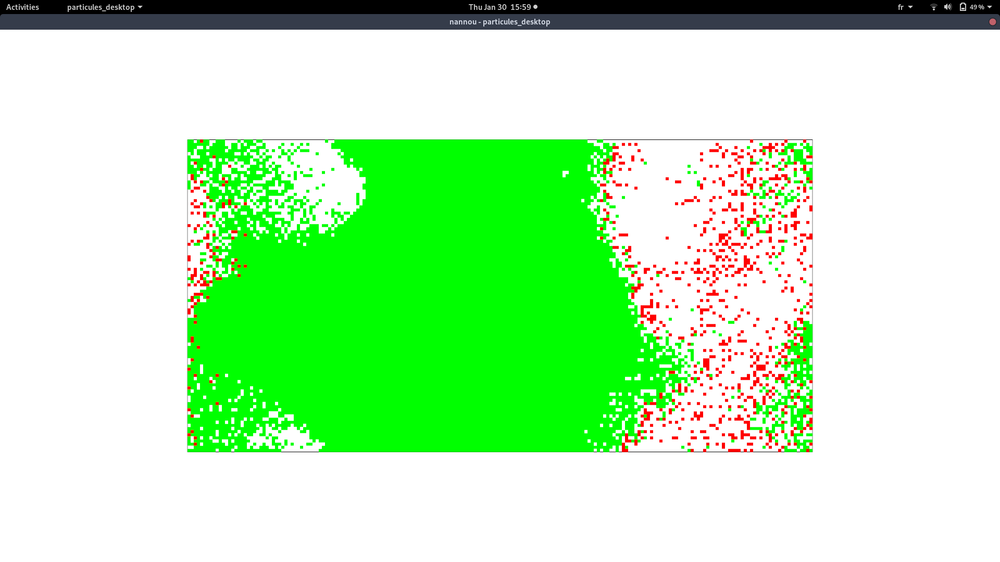
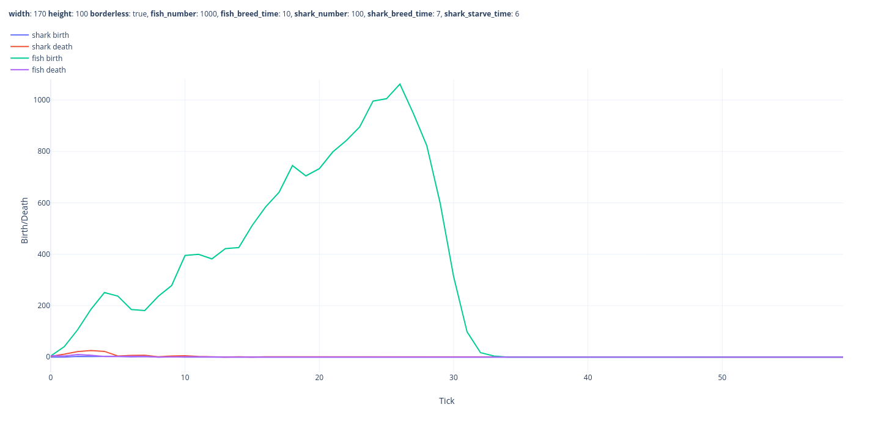
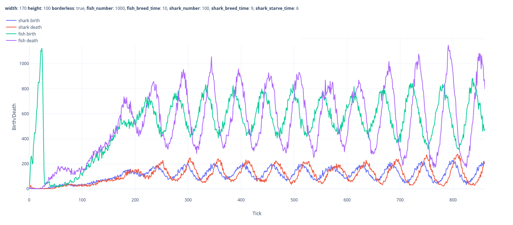
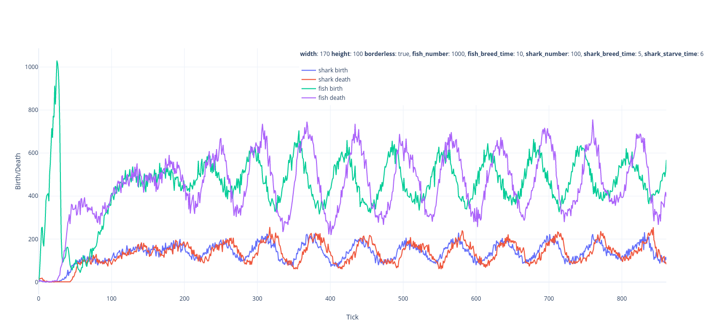

# Modélisation par agent TP 2

## Prérequis

[rust-1.40](https://www.rust-lang.org/learn/get-started)

## Run

- modifier la configuration dans `particules_desktop/config.json`

```rust
cd particules_desktop && cargo run --release
```



## Graph





